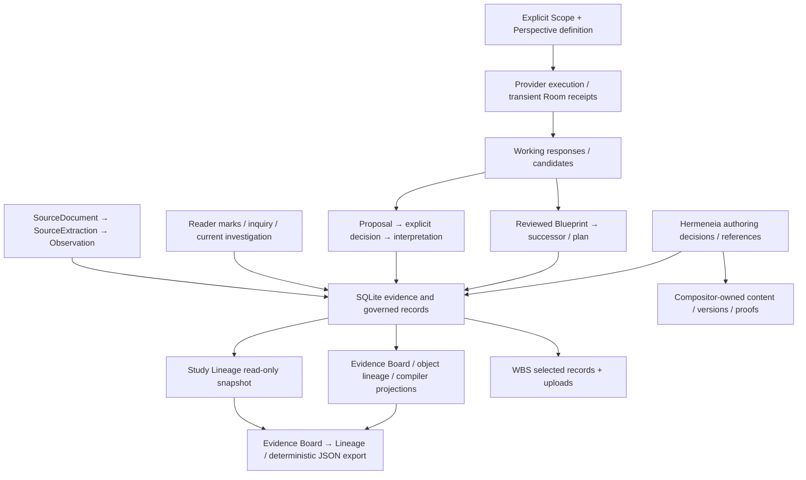

# Capability coaching: architecture and technical-debt audit

Date: 2026-09-29. Audit for [#213](https://github.com/JosephJMWalker-MBA/Hermeneia/issues/213), assessing the direction in [#212](https://github.com/JosephJMWalker-MBA/Hermeneia/issues/212). **Assessment, not ratified architecture or an implementation plan.**

Audited local `main`: `5e1446319754e46c591be94aadc4550e2fe644c7`. This preserves the evidence-only real-workspace validation commit. At inspection, remote `main` was `b5bce9a055bfe469baaecc40df769f3bd50f8c1f`; its two additional commits concern a deferred Performance Manuscript hypothesis and README link. `hermeneia/` and `tests/` have no differences between those heads. Neither history was reset or merged for this audit. No push is authorized.

Evidence consists of source/schema/test inspection, the preserved real-use witness, and reproducible static measurements. No new real workspace was opened, no provider was called, and no production behavior was exercised or changed. Static failure risks below are distinguished from reproduced failures. References use repository-relative paths and starting line numbers at the audited commit; function/table names identify the relevant boundary if lines later move.

## 1. Executive assessment

**READY WITH PRECONDITIONS.** Hermeneia can support bounded, provider-free coaching over known study facts without a new canonical history store or wholesale frontend/domain rewrite. The strongest seams are the read-only, typed Study Lineage projection; explicit proposal/decision and exact Blueprint commit boundaries; and separated Scope, Perspective definition, and provider execution.

The complete #212 ambition cannot truthfully be implemented by counting existing rows. Current storage preserves some immutable creations and decisions, some overwritten snapshots, and no durable history for several proposed achievements. Saved Perspectives do not establish runs; absent coaching records do not establish independence; a Blueprint reason does not prove evidence caused a revision. These are chiefly missing capabilities and historical limits, not evidence that the existing ontology must be replaced.

There is also concrete debt: Reader navigation crosses asynchronous DOM teardown and immediate page rendering; some routes still combine domain validation, SQL and provider orchestration; apparently read-only workspace endpoints can initialize identity; and WBS preserves substantially less evidence than Study Lineage can display. The approval path for exact Blueprint candidates is reusable, but a legacy generate-and-save API remains and must not become the approval contract for natural-language coaching.

Before #212 implementation planning begins, review must establish the supported claim/unknown boundary, distinguish current advice from historical awards, and bound portability and intervention-record authority. Section 19 states these preconditions without prescribing implementation steps. Institutional accounts, complete historical capture, vectors, and universal WBS coverage are not prerequisites for a scoped single-user, deterministic coaching surface.

## 2. Current architecture map

The [Authority Index](../01_Authority_Index.md) routes the [Constitution](../00_Constitution.md), ratified amendments, [invariants](../02_Constitutional_Invariants.md), active ADRs and implementation specifications above code and generated artifacts. [Storage](../15_Storage.md) governs `.herm` evidence/provenance and read-only operations. The [Reader-centered direction](../FROZEN_PRODUCT_DIRECTION.md), [project identity](../What_Hermeneia_Is.md), and [Study Lineage v1 design](study-lineage-v1.md) constrain this audit. The dated [implementation status](../../IMPLEMENTATION_STATUS.md) is operational context, not a fresh test result.



Arrows show existing relationships, not a universal mandatory pipeline. Working responses are not automatically canonical. WBS is a selected exchange surface, not evidence that every DB family survives restore.

Principal implementation locations:

| Responsibility | Existing location and boundary |
| --- | --- |
| Evidence identity/storage | `hermeneia/storage/hashing.py:15`, `sqlite.py:73`; immutable evidence with explicit metadata exceptions |
| Web composition | `hermeneia/web/app.py:188` `create_app`; route closures, SQL, domain helpers and providers coexist |
| Reader/UI/workstations | `hermeneia/web/static/index.html`; shared browser state and navigation helpers |
| Scope and execution | `hermeneia/scope_resolution.py`, `perspective_runs.py`; explicit input identities and returned receipts |
| Staged interpretation | `hermeneia/compiler/staging/interpretation.py:56,145,231`; proposal, accept, reject |
| Blueprint | `hermeneia/compiler/blueprint_extractor.py:91`; `web/app.py:744,783,917`; structured candidate, validation, exact revision |
| Projection | `hermeneia/study_lineage.py:143`; `web/app.py:9392`; one read snapshot, typed records, no initialization |
| Publication authoring | `hermeneia/authoring/service.py:1`, `store.py:22`; human decisions/references versus Compositor content authority |
| Exchange | `hermeneia/workspace/export.py:185`, `restore.py:96,276`; selected rows and capability-specific publication component |

## 3. Healthy extension seams

1. **A usable read-only evidence substrate already exists.** `project_study_lineage` discovers available schemas, preserves typed keys/raw records/provenance, rejects ambiguous ancestry and marks unknown authorship. `/api/study-lineage` and `/export` share serialization and a read transaction (`web/app.py:9392–9414`). A deterministic evaluator can consume this representation without becoming another owner of history.
2. **Human decision and machine generation can remain separate.** Interpretation staging retains proposal and AI provenance separately from accepted canonical interpretation. The Reader Blueprint editor calls extraction with `save:false`, reviews a candidate, and submits the exact reviewed value (`index.html:11696,11760`). The revision helper appends a content-addressed successor and explicit supersession transactionally (`app.py:917`). This is a real seam despite the legacy bypass-shaped alternative discussed below.
3. **No-provider guidance is viable.** Existing onboarding uses declarative steps and deterministic state checks (`index.html:9253,9338`); Perspective identity and Scope are already separate from provider/model configuration. Coaching need not call a model, analyze private text, or mutate Scope merely to suggest a next action.
4. **Publication authoring demonstrates bounded extensibility.** Eight append-only tables retain proposals, human decisions, attempts, results and proofs; Compositor remains content authority. A required WBS capability protects that component. This is an example of a narrow contract, not a template requiring every coaching preference to become canonical.

These claims are grounded in code and existing tests; they do not claim that a complete coaching system or every real-use chain has been validated.

## 4. Concrete debt / hotspots

Measurements are preserved in [measurements.json](../verification/fixtures/capability-coaching-audit/measurements.json), produced by the [read-only script](../verification/fixtures/capability-coaching-audit/measure_architecture.py).

| Observation | Concrete implication | Classification |
| --- | --- | --- |
| `index.html`: 17,922 physical lines, 686 column-zero named functions, 166 column-zero `const`/`let` declarations | Reader, Scope, Board, Lineage, Companion, Blueprint and navigation share one runtime and state namespace; ownership contracts matter before adding contextual actions | Concentration; debt demonstrated by the navigation witness, not LOC alone |
| `web/app.py`: 9,707 lines, 108 route decorators, 220 AST `execute` callsites | Many routes own data assembly and domain decisions directly; new coaching SQL in routes would multiply policy/eligibility owners | Layering debt at touched seams; not a reason to split every route |
| `sqlite.py`: 2,774 lines; `ensure_profile_tables` spans 280 | Schema compatibility, lifecycle and persistence are centralized; constructing a store can migrate it | Intentional compatibility complexity plus read/write lifecycle risk |
| 49 of 207 Python modules contain execute-family callsites | Storage is not an exclusive repository abstraction; read projections legitimately query SQL, but each must respect identity/exclusion/coverage | Distributed dependency, not 49 writers |
| Literal SQL mentions `observations` in 21 modules; `interpretations` and `narrative_blueprints` in 11 each | Table shape changes have multiple consumers; method misses dynamic SQL, including Lineage table adapters | Measured lower-bound coupling, not exhaustive dataflow |
| Two lexical import cycles | `authoring.service` ↔ `authoring.preparation_job`; `cli.preserve_cmd` ↔ `preservation_provenance`. Backedges are function-local in part | Dependency-direction debt; no startup failure demonstrated |

`create_app` spans 9,520 lines because it encloses route/helper definitions; this is **not** one 9,520-line sequential algorithm. Route counts include aliases. SQL-token counts include literal strings and schema statements, not only reads or writes. HTML token counts are lexical and are not live DOM measurements. No performance benchmark or new runtime failure is claimed by these measurements.

## 5. Authority and duplicated-state findings

### Durable ownership inventory

Unless stated otherwise, table schemas are in `hermeneia/storage/sqlite.py`. Schema version is 17 (`:16`); that infrastructure version is not an object, execution, coaching-policy or historical-award version. WBS treatment below describes actual exporter/restore code, not all promises in older prose.

| Record and owner | Table/file and durable identity | Mutability, provenance and versioning | Actual WBS treatment / historical gap |
| --- | --- | --- | --- |
| SourceDocument; compiler evidence | `source_documents.id`, exact file-byte hash (`hashing.py:15`; schema `sqlite.py:78`) | Evidence identity/file/registration protected; source role/exclusion deliberately mutable (`:757,955`). Compiler/time retained; no scope-change history | Rows + uploads restored; current exclusion/role snapshot only |
| SourceExtraction; compiler evidence | `source_extractions.id`, document/parser/version/locator (`sqlite.py:89`; `hashing.py:47`) | Exact raw parser output; immutable, `extracted_at` | Rows restored verbatim; no reconstruction from current files |
| Observation + forensic lineage; compiler evidence | `observations.id` occurrence hash and `provenance.id` (`sqlite.py:106,129`; `hashing.py:66`) | Immutable text/ancestry, offsets, compiler/run/time. Equal text is not equal occurrence | Observation rows restored; **provenance table omitted** |
| Readability/search; derived support | `observation_derived`, `terms`, `observation_terms` (`sqlite.py:146`) | Rebuildable derived values/index; derivation version/time are not human actions | Omitted; not independent accomplishment evidence |
| Reader marks; Reader annotations | `reader_highlights.id`, document/page/locator, optional Observation (`sqlite.py:1065`) | Note/question/rank/buckets/status overwrite; created/updated time, no actor/origin/revision series (`app.py:8058,8083,8356`) | Current rows + derived questions/buckets/ranks; prior edits unavailable |
| Reading progress; Reader operations | `reading_progress.id`, unique document (`sqlite.py:1096`) | Aggregate pages/current last page/completion/update time; mutable | Used in synthesis derivation; no own restored progress table or sessions |
| Corpus Field Notes; investigation log | `investigation_log.id`, lane, optional document/page, captured question (`sqlite.py:1141`) | Creation time; authorship unknown. No-update trigger, but no no-delete trigger in current DDL | Both corpus and instrument lanes exported; corpus Lineage omits instrument lane |
| Observation review; inquiry workflow | `observation_reviews.id`, unique Observation (`sqlite.py:1034`) | Current review/reason/note/pass updated in place (`app.py:6842`); no actor or prior values | Omitted |
| Inquiry question; inquiry workflow | `inquiry_notes.id`, Observation/review (`sqlite.py:1049`) | Creation time; can be deleted (`app.py:6886,6922`); no actor/tombstone/version | Omitted; deleted question not recoverable |
| Governing investigation; human workspace intent | `workspace_investigation.id='current'` (`sqlite.py:1164`) | Explicit mutable singleton with created/updated time, question/purpose/lenses/reconsider | `investigation.json` restored; incidental Field Note copies are not question revisions |
| Perspective definition; governed interpretive frame | `perspectives.id`, label-v1 or frame-v2 fingerprint (`sqlite.py:168`) | Immutable declarations; explicit supersession; frame-v2 declaration actor/date; provider/model excluded from identity | WBS1.1 rows and Perspective supersessions; old missing fields remain unknown |
| Perspective/Room runs; execution service | Returned receipts from `perspective_runs.py:494,641` | `canonical_status=not_persisted`; question/Scope/model/outcomes transient | No durable run record to export |
| Model proposal; staging | `proposed_interpretations.id`, AI/Observation/Perspective/evidence refs (`sqlite.py:474`) | Terminal status guard; decision actor/time/rationale. Not every content/decision field is frozen by trigger | Omitted; absence after restore does not prove no proposal occurred |
| AI provenance; staging execution/acceptance | `ai_provenance.id` (`sqlite.py:424`) | Model/version/prompt/parents/parameters/schema/time; generation fields guarded, accepting steward once. Timestamp/rationale not independently protected by that guard | Omitted; never infer historical execution from current settings |
| Interpretation; canonical interpretation | `interpretations.id`, typed evidence refs (`sqlite.py:204`; `hashing.py:294`) | Immutable source/text/time, optional AI provenance/supersession; human actor not on ordinary canonical row | Omitted |
| Interpretation Critic; evaluator | `critic_reports.id`, proposal/Observation/policy/claims/evidence/verdict (`sqlite.py:519`) | Core immutable; normalization flag/notes mutable, no normalization actor/time (`:2363`); no critic model link | Reports deferred; verdict is not human adjudication |
| Blueprint; governed structure | `narrative_blueprints.id` content hash; support link pairs (`sqlite.py:233,253`; `hashing.py:85`) | Immutable title/thesis/sections/source/time; `extracted` not complete model provenance | Blueprint and support links omitted |
| Supersession; governed successor relationship | Composite `(old_id,new_id,reason,ratified_at)` (`sqlite.py:691`) | Immutable but endpoint IDs untyped; no edge actor/typed cause. Ambiguity must be refused | Only Perspective supersessions exported, not Blueprint/Interpretation edges |
| ArchitectPlan; deterministic compiler | `architect_plans.id`, paragraph `(plan_id,order_idx)` (`sqlite.py:289`) | Immutable Blueprint/hash/source/time; ID recipe uses Blueprint ID (`hashing.py:154`), no independent compiler policy version in row | Omitted |
| Expression and generated narrative | `expression_profiles.id`; `rendered_narratives.id` (`sqlite.py:335`) | Immutable configuration/text/provider/prompt, optional execution config; added status/rationale lacks decision actor/time | Omitted; status is not a reconstructed decision event |
| Narrative Critic and governance | `validation_reports`, `findings`, `steward_decisions`, `witness_sessions`, `ratification_records`, each real `id` (`sqlite.py:388,553`) | Immutable linked reports/method/constitution version, decision actor/rationale/time, witness and ratification snapshots | Governance deferred; WitnessSession is not ordinary reading-session history |
| Workspace identity; workspace runtime | `workspace_identity.id='current'`, UUID/name/time (`sqlite.py:1182`; `workspace/identity.py:59`) | Stable workspace ID through API; mutable name. Not participant identity | Manifest ID previewed, identity/name row not installed on restore |
| Study Lineage; projection owner | `hermeneia.study-lineage/v1`, typed table + real key | Read-only record views, raw provenance, timestamp basis, unknowns; no event store | Standalone deterministic export. WBS `lineage/lineage.json` is a **different**, older synthesis projection |
| Companion/onboarding | Browser localStorage preference + in-memory transcript (`index.html:9231,9251`) | Current onboarding booleans/time; no historical policy/input/response series | Not WBS; browser origin state is not workspace accomplishment |
| Connections/credentials | `connections_settings.py:1`; `credentials.py:1` | Machine/user configuration and OS credential boundary, separate from corpus | Excluded; preserve this separation |
| Calibration/diagnostics | Workspace-adjacent `calibration.json`; `_perf_log` (`app.py:223,244`) | Mutable calibration; in-memory bounded diagnostic log | Not WBS, study lineage, consent or research dataset |
| CLI build/preservation/release | Separate build/preservation files | Their integrity contracts do not establish a workspace study event merely by filename/location | No automatic workspace event or export association |

Publication authoring is an intentional separate authority boundary, not a parallel Blueprint store. `authoring/service.py:1–9` assigns interaction/decisions/references to Hermeneia and content/versions/receipts/proofs to Compositor. `READER_BRIDGE_STATUS='unresolved'` (`:36`) forbids inventing a Reader evidence bridge.

All eight authoring tables below have update/delete guards (`authoring/store.py:142`). All are included with referenced artifacts when the WBS `publication-authoring-v0` capability is present. Their content/version refs are explicit; their timestamps do not supply missing actors or causal links.

| Table / owner within authoring | Identity and retained provenance |
| --- | --- |
| `publication_works` / attachment | `id`, unique workspace; root version, inputs, local work root, renderer/facade pin, attached_by/at (`store.py:34`) |
| `publication_artifacts` / byte references | `sha256`, work/kind/path/length/time; byte verification on read (`:50,209`) |
| `authoring_drafts` / working text snapshot | `id`, work/parent version/unit/text/time; no actor (`:59`) |
| `authoring_proposals` / editorial proposal | `id`, exact unit text/semantic hashes, before/after, rationale/proposed_by, proposal digest/validation/time (`:68`) |
| `authoring_decisions` / human decision | `id`, unique proposal, digest, approved/rejected, actor/rationale/workspace/target/time (`:89`) |
| `authoring_requests` / execution attempt | `id`, decision + attempt uniqueness, expected parent/idempotency/artifact digest/time (`:102`) |
| `authoring_outcomes` / application outcome | `id`, request uniqueness, work/chain index, accepted/refused/error, version/receipt/ledger/overlay/findings/time (`:114`) |
| `authoring_proofs` / output verification | `id`, work/version/status/result/PDF hashes/refs/findings/time (`:131`) |

The current manuscript is derived from accepted outcomes (`store.py:241`), not a second editable head. Submitted actor strings preserve assertions, not authenticated identities (`web/authoring_api.py:27`). Editorial acceptance must not be relabeled as acceptance of a model interpretation.

### Ambiguity and enforcement limits

- **Storage versus bundle wording:** `docs/15_Storage.md:20–35` makes the DB the authoritative evidence graph. `docs/workspace-bundle-spec.md:3–32` still says design/no implementation and describes runtime storage as disposable, while its `:298–309` intentionally narrows the first export. Actual `.herm` SQLite backup (`storage/repository.py:35`) and selected JSON WBS exchange are different operations. This is documentation/coverage debt; it does not authorize discarding DB evidence or silently expanding WBS authority.
- **Read-only is a boundary-specific claim:** GET workspace export and identity call `_conn_rw()` and `ensure_workspace_identity` (`app.py:8653,8682`; `workspace/identity.py:61` inserts/commits when absent). Storage's read rule (`docs/15_Storage.md:262–267`) forbids initialization on reads. Study Lineage intentionally avoids this. Source inspection establishes the write path; no real workspace was mutated to demonstrate it here.
- **Acceptance is not one transaction:** staging acceptance calls proposal decision, AI acceptance and canonical insertion sequentially (`compiler/staging/interpretation.py:192–226`); store commits occur at `sqlite.py:2649,2713,2763`. Partial outcome is a static failure risk, not an executed fault witness. `INSERT OR IGNORE` also deliberately preserves an existing canonical interpretation (`:2746`); an accepted proposal alone cannot prove it created that row.
- **Comments are not complete immutability evidence:** Field Notes lack a no-delete trigger; proposal and AI acceptance guards do not cover every field. Narrative status PATCH (`app.py:3798`) attempts an UPDATE blocked by the unconditional rendered-narrative no-update trigger (`sqlite.py:903`). This route/schema conflict was inspected, not runtime-reproduced. Do not count an affordance or a column as demonstrated durable adjudication.

## 6. History/event durability matrix

**A** durable and reconstructable; **B** durable current snapshot only; **C** partially reconstructable; **D** transient; **E** absent. These classify the recorded operation, not intellectual merit. Prospective seams below identify where evidence could belong if separately approved; they are not instructions to add tables or a general event store.

| History requested by #213 | Class and present evidence | Smallest principled future seam / limit |
| --- | --- | --- |
| Capability use | C: typed creation/decision records establish specific operations (`study_lineage.py:15,397`); opening Board/Lineage is not durable | Reuse actual output/decision IDs. Record only otherwise-unrepresented outcomes needed by an approved claim; no click proxy |
| Propose/accept/reject | A for extant interpretation proposal decisions; C across all model participation (`staging/interpretation.py:56,145,231`) | Validate complete linked outcomes. `web-steward` and default rationale (`app.py:5905`) are recorded defaults, not proof of person or reason |
| Perspective execution | D for `/api/perspective/run` and `/room`; A for saved definitions/revisions (`app.py:4648,4701`) | Existing receipt is the natural evidence boundary if retention is approved; bind exact frame/question/Scope/execution/output/outcome, not current configuration |
| Interpretation creation | A: extant immutable rows and linked AI acceptance where valid (`sqlite.py:204`) | Existing authority suffices; no second creation ledger |
| Interpretation revision/cause | C: generic supersession possible; ordinary PATCH refuses editing (`app.py:7718`) | Governed successor and explicit attributed cause if needed. Separate rows/times are not automatically revisions |
| Contradiction review | C reports; B normalization/Observation review (`compiler/critic/report.py:22`; `sqlite.py:2363`) | Explicit human outcome at review boundary with cited inputs; machine verdict remains a finding |
| Blueprint revision/cause | A saved content/explicit edge; C attributed evidential cause (`app.py:917`) | Existing successor remains owner; attributed cited rationale needed for a stronger causal claim |
| Coaching intervention | E workspace history; D/browser-local current checklist/preferences (`index.html:9314`) | Policy/version/input/response evidence needs an explicit owner and retention purpose; not automatically study evidence |
| User accept/edit/reject/ignore | C: interpretation and editorial decisions durable; other edits snapshots/transient | Bind decisions to concrete proposals. Pending does not mean ignored; ignore needs an observation-window contract |
| Study/reading sessions | B aggregate progress; E sessions (`app.py:8285`; `sqlite.py:1096`) | Session claims need defined, consented observation semantics; page sets do not prove time or comprehension |
| Achievement evidence/awards | C structural prerequisites; E rule-versioned award/history | Derived evaluation over cited evidence; missing coverage remains unknown. Historical awards require a separate approved preservation contract |

Chronology is not causality. Comparable recorded timestamps can order instants, not prove attention, independence or why an interpretation changed. Unknown, excluded, missing, malformed and not-yet-performed are different states.

## 7. Study Lineage extensibility

Study Lineage can remain the **shared read-only substrate for supported durable study facts**, not a complete behavioral log or integrity verifier. Its 29 record families and seven auxiliary families (`study_lineage.py:15–46`) are loaded within a caller-owned read snapshot. `_PARENTS`, canonical classes and supersession resolution retain typed ancestry (`:56–99`); exclusion eligibility recursively filters descendants (`:238–322`). Authorship classification checks recorded source/AI acceptance linkage (`:324–350`). Unknown stays unknown.

The output keeps exact record data and provenance, plus presentation previews, event type and timestamp basis. A future evaluator must use the durable data, references and coverage, not truncated previews or display labels. Schema coverage is not proof of complete historical activity. Deterministic JSON (`serialize_projection:106`) avoids a new store; frontend type/authorship/order filters and export consume the same representation (`index.html:13494–13681`). Filtering does not admit Scope or call providers.

Record handling already uses central conditional branches for eligibility, authorship, context and provenance. Adding many types directly to those branches would raise review cost. This is a candidate bounded adapter seam when touched, not evidence that an abstraction rewrite is required now. The implementation fetches whole tables and scans provenance/support rows per item (`:161,367`); possible scaling cost is static inspection, not a measured latency defect.

Other projections have legitimate distinct purposes: object ancestry (`app.py:2087`), Evidence Board inventory (`:9417`), synthesis-packet lineage (`study/synthesis_packet.py:298,419`), and compiler review/Critic/divergence projections. Their existence is not itself duplicate authority. A new coaching-specific history reader with independent authorship/exclusion rules would create avoidable duplication. WBS's older `lineage/lineage.json` must not be mistaken for Study Lineage v1.

Tests `test_study_lineage.py`, `test_study_lineage_api.py` and `test_study_lineage_ui.py` cover identity separation, missing schemas, exclusions, unknowns, read-only projection/export and UI filtering. Their context-dispatch test stubs `_attnOpen`; it does not establish Reader navigation completion.

The [preserved real-workspace validation](../verification/2026-09-28-study-lineage-real-workspace.md) checked 4,503 projected rows, including 395 marks, against storage with exact timestamps/provenance. It found no proposal/interpretation/Blueprint rows and no excluded documents. It therefore does **not** validate the desired complete Gatsby chain or real excluded-descendant case. The projected page-1 identity was correct; the reused Reader lifecycle failed and restored page 62. That negative evidence remains unchanged.

## 8. Companion/onboarding extensibility

| Concern | Current implementation | Readiness assessment |
| --- | --- | --- |
| Rule descriptions | `_CMP_ONBOARDING_STEPS`, `index.html:9253` | Static data can remain provider-free; not yet a versioned coaching policy |
| State detection | `_cmpStepComplete:9338`, `_cmpStepsWithStatus:9346` read `_crDocId`, `invLoad().thesis`, `_crHighlights` | Separable conceptually, currently coupled to UI caches/current state; cannot prove historical accomplishments |
| Preference state | `_CMP_ONBOARDING_KEY:9251`, load/save `9314,9327` | One browser-origin key, mutable paused/finished/completion state; no workspace/participant identity or policy receipt |
| Presentation/navigation | Render/message `9377,9388`; actions `9478` | Deterministic suggestions feasible; action completion/Reader readiness is separate |
| Provider response | `cmpAsk:9641`; `api_companion_ask`, `app.py:8379` | Explicit contextual opt-ins, but route combines context assembly/exclusion/provider call; response transient |
| Human retention | `cmpUseResponse:9620` | Prefills attributed editable Field Note draft; does not save or canonicalize response. Plaintext attribution is not a typed immutable execution receipt |
| Room | `_crRoomParticipantsPayload:11003`, `_crRunPerspective:11204`; server `app.py:4701` | Exact Perspective IDs, materialized Scope receipts, success/fail/not-run statuses and epoch guards are useful seams; run receipt remains transient |

A versioned deterministic policy can be independent of the Companion character and provider response surface. Existing controls demonstrate feasibility; no new policy is selected here. Local preferences should remain preferences rather than evidence that a study capability was mastered.

Static risk requiring a bounded check before reusing Companion's context assembler: current-page and Observation queries join excluded-document conditions (`app.py:8438,8499`), but highlight/trail queries (`:8455,8481`) do not carry the same condition. `tests/test_companion_api.py:157` covers the former. This audit does **not** claim a reproduced disclosure; it records an exclusion-contract gap to resolve at any touched provider-input boundary. No-provider coaching need not inherit that assembler.

Room participants later in the sequence receive prior readings (`app.py:4753–4761`). Similar outputs are not automatically independent agreement. Displaying failures/not-run states is a healthy negative-evidence boundary worth retaining.

## 9. Blueprint natural-language readiness

The requested intent → structured proposal → human review/edit → governed revision flow has reusable pieces. `extract_blueprint_from_text` (`compiler/blueprint_extractor.py:91`) produces a structured candidate without storage writes. Reader generation uses `save:false` (`index.html:11725`); commit clones the reviewed candidate and chooses exact ratification or revision (`:11760`). Server validation checks shape/references; ratification does not rerun the provider (`app.py:7237`). Revision validates reason/content/existence, retry idempotence and cycles and appends successor/links/plan/edge in one transaction (`:917`). `tests/test_blueprint_exact_commit.py` and `test_reader_blueprint_editor.py` are focused seams.

Four limits matter before planning this part of #212:

- Legacy `/api/pipeline/extract-blueprint` still supports `save:true`, generating and immediately persisting the result (`app.py:7188–7227`; `test_blueprint_extractor.py:184`). This is an explicit existing combined request, not exact post-generation candidate review. Future assistance must not reuse it as if it were the reviewed-candidate approval contract. No behavior is changed by this audit.
- Blueprint source/time lacks model/prompt/actor/candidate receipt (`sqlite.py:233`). Ratification says `extracted`; revision says `steward-authored` regardless of working candidate history (`app.py:7253,1016`). These labels cannot establish authorship of every phrase or reconstruct model participation. Lineage's conservative classification must remain.
- Supersession reason is free text, not typed evidence-caused revision. Content identity deduplicates identical candidates; competing Blueprint successors are explicitly supported (`test_blueprint_exact_commit.py:455`). Perspective revisions instead require a leaf (`sqlite.py:1773`). These are intentional distinct semantics, not a cleanup opportunity.
- Rejected Blueprint candidates, edit sequences and intent→candidate review history are not durable. A new assistant must neither manufacture them nor create a parallel Blueprint authority. Untyped supersession endpoints remain ambiguous if more than one record class matches.

## 10. Capability Graph placement options

These are placement comparisons, not a chosen schema or implementation sequence.

| Option | Reproducibility/versioning | Testability/coupling | Migration and authority burden |
| --- | --- | --- | --- |
| Static versioned declarative files | Exact definitions can be pinned/digested; release revision alone should not silently redefine historical rules | Validate explicit prerequisites/relationships separately from UI; pure evaluation possible | Least stateful; no workspace migration merely to ship definitions |
| Python domain objects | Deterministic typed predicates; executable semantics tied to code plus explicit rule version | Strong unit-test seam; risk hardwiring prose/pedagogy/provider assumptions into code | No DB migration; code deployment needed for definition changes |
| Database configuration | Mutable definitions require revision/identity/retention and historical binding | More fixtures and lifecycle/authorization paths; easy accidental per-workspace divergence | Adds persistence/custody/migration choices without demonstrated first-profile need |
| Mixed: versioned declarations + Python evaluator | Stable symbolic definitions and executable checks can each be identified | Separates definitions, observed facts and rendering; avoid two competing rule sources | Lowest-state viable candidate if both versions are explicit; DB only for separately justified durable outcomes |

The least-stateful viable direction is versioned declarative definitions with deterministic evaluation over supported facts. This is an audit recommendation, not ratification of a new canonical object. Embeddings can remain optional advisory candidate retrieval keyed to definition/input/model/configuration versions. They cannot create prerequisites, alter provenance, award achievements, admit Scope, or bypass symbolic eligibility/refusal.

## 11. Achievement derivability matrix

Classification: **Now** means a precisely bounded structural predicate derivable from durable records, **History** means a prospective explicit outcome/receipt or attribution plus a reviewed rule could support the stated claim, **Unsupported** means a missing semantic/causal/independence relation or operation that more timestamps alone cannot supply. “History” is not permission to add a generic event store. Every future award also needs a rule version, exact evidence references, coverage/unknown handling and a distinction between recomputation and historical award evidence.

**No full named #212 award is currently established by row counts or the existing UI checklist.** There are useful Now predicates: exact proposal decisions; validated accepted-interpretation ancestry; saved Blueprint content/supersession; distinct evidence/source IDs; and pairwise evidence-set differences. Those narrower facts must not silently redefine “deliberate,” “meaningful,” “because,” “independent,” “legitimate” or “without coaching.”

| Foundational achievement | Full claim | Available fact and missing boundary |
| --- | --- | --- |
| Full Cycle | Unsupported | Saved stages exist; no explicit complete connected cycle/protocol, lineage review, governing-question history or guaranteed adjudication. `api_project_context` counts (`app.py:7080`) are not a cycle |
| Evidence Before Conclusion | History | Now: exact evidence→accepted proposal/interpretation links and comparable timestamps. Support/prior examination and human promotion semantics need an explicit scoped rule/outcome |
| Devil's Advocate | History | Critic or contrary evidence may exist; deliberate contrary-evidence seeking/review and outcome are not established |
| Changed My Mind | Unsupported | Rejecting a model proposal is not necessarily revising one's interpretation. Missing ordinary governed interpretation revision/cause chain |
| Provenance Intact | History | Now: typed links and missing provenance inspectable. Complete-cycle coverage and actual byte/integrity checks are not supplied by metadata projection (`study_lineage.py:436`) |
| Blueprint Steward | History | Now: exact successor and reason/time. Typed/attributed evidence-change cause absent |
| Open Question Keeper | History | Extant question text is not an explicit legitimate unresolved-after-review outcome; question fragments lack independent identity |
| Independent Investigator | Unsupported | Complete cycle unavailable; no complete coaching observation window. Missing interventions never prove no intervention |

| Perspective ladder | Full claim | Boundary |
| --- | --- | --- |
| Perspective Explorer | History | Successful receipt exists transiently; durable execution and reviewed meaning of meaningful use needed |
| Second Opinion | History | Exact question/Scope/frame receipts could establish a second run; provider/model difference is not distinct Perspective semantics |
| Multiple Lenses | Unsupported | Three outputs do not prove human comparison without collapse |
| Agreement Mapper | Unsupported | Identical claim text is not independently supported agreement; Room shares earlier outputs |
| Dissent Finder | Unsupported | String difference or Critic verdict is not a preserved substantive disagreement assessment |
| Evidence Split | Unsupported | Now: evidence-set differences for canonical interpretations; missing user recognition and causal emphasis claim |
| Assumption Spotter | Unsupported | No durable assumption→Perspective claim/adjudication relation |
| Minority Report | Unsupported | Surviving rows do not establish intentional preservation despite majority pressure |
| Perspective Revision | Unsupported | Perspective-definition revision is not interpretation revision caused by a run |
| Perspective Resistance | Unsupported | Proposal rejection lacks consensus→source-supported override relation |
| Triangulator | Unsupported | Multiple references/different text do not prove novel synthesis or uncopied authorship |
| Perspective Cartographer | Unsupported | Pairwise structural projection is not a claim/assumption/disagreement/adjudication map |
| Adjudicator | History | Now: explicit proposal decisions. Competing-Perspective part-level outcomes need bound comparison inputs and decisions |
| Independent Synthesis | Unsupported | No proof Perspectives informed but did not determine reasoning; absent AI provenance is not human-independence proof |

`compiler/projections/interpretive_divergence.py:185` is a useful existing comparison: normalized exact-text matches, evidence-set differences, `persistence:'none'`. It expressly returns contradiction `not_computed` because no ratified deterministic rule exists (`:243`). Its explanatory `why_it_changed` is not historical evidence of human motivation.

| Restraint achievement | Full claim | Boundary |
| --- | --- | --- |
| Not Enough Evidence | History | Explicit rejection exists; generic rationale does not establish insufficient support. Requires a scoped declared reason and cited evidence, not text guessing |
| Leave It Open | History | Current uncertain/deferred state is not necessarily an explicit reviewed unresolved decision |
| False Lead | Unsupported | Rejected proposal is not a previously promising hypothesis abandoned because of evidence |
| Duplicate Insight | Unsupported | Similar/identical text is not a recorded human equivalence decision and cannot collapse identity |
| Scope Discipline | History | Current exclusions/selection and transient receipts do not prove a question-bound refusal on relevance grounds |
| No Consensus Needed | Unsupported | Multiple surviving interpretations do not prove deliberate retained disagreement |

| Deeper progressions from #212 | Class | Missing beyond present primitives |
| --- | --- | --- |
| Full Cycle ×3 / ×5; Consistent Investigator / Research Habit | Unsupported | Distinct verified cycles, period/recurrence definition and complete coverage |
| Multiple Supports; Source Diversity | History | Now: distinct linked evidence/document IDs. Support and meaningful diversity require reviewed criteria; files need not be independent sources |
| Evidence Weighting; Evidence vs Counterevidence; Claim-Evidence Audit | Unsupported | Current mark rank/relevance is not governed claim weighting/adjudication/audit |
| Counterexample Hunter; Strongest Objection; Steelman; Survived Challenge; Adversarial Steward | Unsupported | Deliberate challenge, strength/fairness criteria and linked response/retention outcome |
| Evidence Changed My Mind; Model Changed My Mind; User Corrected the Model; Revision With Cause; Intellectual Evolution; Revision Cascade | Unsupported | Attributed typed cause/contribution and governed interpretation successors; Blueprint/editorial changes are not substitutes |
| Source Discipline; Forensic Study | History | Now: forensic IDs/ancestry. Need scoped integrity/coverage rule; not proof of diligence |
| Structural Revision | History | Now: content-changing Blueprint successor; methodological significance/attribution is a separate criterion |
| Living Blueprint; evidence-driven multi-version stewardship | History | Explicit graph exists where stored, but typed evidence causes/distinct reviewed occasions do not |
| Question Deepener; Better Question; Question Lineage; Long Return | Unsupported | Question overwrites/deletes and no explicit predecessor/revisit/cause chain |
| Self-Directed Expansion; Method Builder | Unsupported | Complete intervention coverage, independent reuse and defined method evidence absent |

| Rare/emergent achievement | Class | Boundary |
| --- | --- | --- |
| Unexpected Connection; Cross-Pollination | Unsupported | No durable cluster/bucket/motif identity or connection-and-use relationship; labels cannot become identity |
| Long Return; Better Question | Unsupported | No question evolution/revisit/cause chain |
| Reversal | Unsupported | Blueprint successor exists, but section index is not durable claim identity or proof of semantic reversal caused by evidence |
| Missing Piece | Unsupported | Missing identified-gap→search→acquired-evidence relationship |
| Against the Crowd | Unsupported | Missing consensus/source-based retention comparison and rationale |
| Convergence | Unsupported | Time ordering/similar text do not prove independent reasoning and corroboration |

## 12. Synthetic Study Lab strategy

Existing seams support future isolated trajectories without touching real workspaces:

- `tests/test_study_lineage.py` supplies typed records, exclusion descendants, ambiguous identities, missing coverage and authorship cases. Direct SQL is appropriate for destructive/legacy fixtures; it is not proof a legal user workflow can produce that state.
- `tests/test_companion_api.py:33,71` provides temporary stores and a capture provider; `test_perspective_room_ui_state.py` exercises delayed responses/Scope epochs. Root `conftest.py` isolates credentials and makes live providers opt-in. Deterministic negative/error outcomes need no network model.
- Staging methods, exact Blueprint commit routes, and `authoring.service` are existing production boundaries for lawful synthetic creation/decision/revision. Tests that assert those transitions should use those boundaries, keeping deliberately invalid SQL fixtures explicitly labeled.
- `hermeneia/authoring/synthetic_work.py:1,128` constructs synthetic Compositor artifacts with its actual builders/verifiers and synthetic text/font. It requires the configured Compositor runtime; it is not a general study-history generator or evidence from participants.
- The [frozen Reader-context witness](../verification/fixtures/study-lineage-v1-real-workspace/reader_context_witness.py) extracts actual navigation functions with a deferred response, not sleeps. It preserves a real failure without private text or database copies.

Future scenario definitions, expected facts, rule versions and evaluation results belong in explicit synthetic/research fixtures, not real study records. A scenario should distinguish lawful trajectory, intentionally corrupted evidence, incomplete legacy coverage and unsupported claims. Empty/missing evidence and false positives deserve fixtures as much as successful suggestions. No scenarios, product flags or new builders are implemented here.

## 13. Metrics/governance boundaries

| Concept | Evidence owner / legitimate inference | Boundary |
| --- | --- | --- |
| Canonical study records + derived Study Lineage | Existing evidence/decision owners; exact recorded identities and outcomes | Not a comprehensive telemetry stream or automatic proof of quality |
| Local product telemetry | Optional operational observations such as navigation/errors | Not canonical inquiry; collection/purpose/retention separate from study evidence |
| Coaching-policy evaluation | Versioned evaluator, inputs/coverage, suggested/withheld result and any actual response | Current recommendation is not proof intervention was shown, accepted or helpful |
| Research dataset | Explicit frozen protocol, consent/purpose, provenance and sampling | Synthetic versus real, observational versus causal conclusions must remain separate |
| Institutional research export | Purpose-specific approved extraction, minimization and access | WBS backup/Lineage export is not de-identified research export |
| Diagnostics | Errors, timings/runtime information (`app.py:244` existing bounded log) | Not achievement history, participation consent or training authorization |

Reduced coaching interaction is not by itself improved independence: the system may have been unused, logging may be incomplete, or the user may have ignored it. Outcome definitions and denominators must distinguish these cases. Missing coaching history must never produce an independence award. Versioning model/configuration can audit nondeterministic suggestions; it cannot retroactively make them deterministic.

## 14. Institutional extensibility notes

The inspected system is a local workspace application, not an institutional identity/permission system. `workspace_identity` identifies a workspace; `source_role` controls corpus role, not user access. Steward/author strings are supplied assertions. Supervisor checks local child/workspace association (`web/supervisor.py:368`), not teacher/student authorization.

No participant ownership, role grants or purpose-limited consent records appear in the inspected stores/routes. These are blockers for claims of student ownership, teacher/researcher access control or consent enforcement, **not** for local provider-free coaching. Access, instruction, research participation, aggregate research, model evaluation/training and publication require separate future authority decisions; one permission must not imply another.

WBS includes source bytes, exact annotations/rationales and both Field Note lanes. Lineage exports raw records/provenance. IDs/hashes, timestamps, local paths, quotations and actor labels can reveal identity; removing a name does not make these de-identified. Credentials already remain outside corpus evidence (`credentials.py`, `connections_settings.py`); preserve that boundary. This audit makes no legal compliance claim and specifies no account system.

## 15. WBS/export/restore implications

Actual non-publication `_TABLE_FILES` (`workspace/restore.py:34`) lists six tables: documents, extractions, observations, Perspectives, Reader highlights and investigation log. Current investigation and Perspective supersession restore separately. Reports/governance are explicitly deferred (`export.py:14`; `restore.py:9`). Missing provenance, reviews, inquiry, interpretations and Blueprint history nevertheless mean a restored workspace cannot be presumed to carry the same achievement evidence.

WBS1.2's publication component provides a stronger, explicit local example: required capability, all referenced artifacts, hashes/closure and accepted-chain validation (`export.py:288–343`; `restore.py:132–230`). Unknown required capabilities refuse restore. The general loader (`restore.py:103–115`) treats absent ordinary JSON files as empty and does not perform equivalent ordinary-file manifest hash validation; unknown version alone is not rejected there. These are static observations, not a new corruption/race experiment.

`build_workspace_zip` uses a read-only connection but no single explicit transaction across all reads (`export.py:370,411`); concurrency consistency is unproven. Route-level identity initialization differs from pure exporter nonmutation tests. Manifest workspace ID is previewed, not restored as identity (`restore.py:269,321`), so cross-restore workspace continuity must not be assumed. None of these findings authorizes WBS changes in this packet.

| #212 concept | Likely bounded bundle consequence, subject to the claim being approved |
| --- | --- |
| Capability definitions, protocol/checklist/rubric/coaching/achievement rules | **No bundle change** merely to ship versioned product assets. A durable conclusion must retain exact rule identification |
| Current capability-state/checklist projection | **No change** for recomputation; **optional derived metadata** if exported/cached with input/coverage/rule binding |
| Embeddings/advisory vector matching | **Explicit exclusion** or optional rebuildable cache; not a required capability for authoritative awards |
| Historical achievements/accomplishments | **Possible new required capability and version semantics**, only after historical evidence/portability contract is approved; current recomputation must not rewrite old awards |
| Actual intervention and user response | Explicit retention/owner/export decision; a durable outcome may require capability/version semantics. No automatic generic event store |
| Natural-language Blueprint work | Existing Blueprint/decision authority retained; broader durable participation claims need explicit coverage. Current WBS already omits Blueprint history |
| Scenario definitions/synthetic evaluation | **No WBS change**; separate versioned test/research artifacts |
| Product telemetry/diagnostics | **Explicit exclusion by default** from study exchange; separate purpose-specific export if later approved |
| Research/institutional metrics | Separate consent/minimization/export contract; no relabeling WBS as research data |
| Ownership/consent/roles | Missing authority domain; explicit decision before records/capabilities/migration, not reuse of actor strings or source roles |

The required decision before planning is the promised scope: local current-state advice, preserved historical claims, portable claims, or some explicit subset. Full all-table WBS implementation need not precede the first bounded coaching work.

## 16. Frontend debt assessment

The single inline JavaScript region spans 14,234 lines (`index.html:3686–17919`), beside 3,090 CSS lines. Prefix groupings include 296 `_cr` functions, 22 `_evidenceBoard` and 11 `_studyLineage` functions (lexical inventory, not independent modules). Twelve workstation panels share `_crBottomPanels` and open/sync dispatch (`:9914,9936,9988`). Existing host reuse is useful; shared lifecycle state is the constraint.

The reproduced failure is exact:

1. `_studyLineageOpenContext:13660` passes the correct document/page to `_attnOpen:13169`.
2. `e10Go:8164` starts `e10LoadCloseReader:9020`, which removes Reader DOM before awaiting documents.
3. Same-document navigation immediately calls `_crGoToPage:13027` and `_crRenderPage:14249` against the missing container.
4. Reload later opens the document (`_crOpenDoc:13684`) and restores saved page 62 instead of requested page 1.

This demonstrates a missing navigation-readiness contract, not incorrect Lineage evidence. `_corpusOpenResult:13021` uses a similar route/immediate-navigation pattern; it is an untested sibling risk, not another reproduced defect. `_crRenderPage` also resets transient selection/Scope/Board, updates focus/speech/progress and fetches observations. `_wsApplyCurrentWorkspace:4725` and `_crResetReaderTransientSelectionForContext:14791` distribute reset ownership further.

Checklist/status presentation can reuse existing workstation/Companion hosts. Contextual actions cannot be considered sound just because dispatch selects the correct function. Their completion, workspace identity, cancellation and preservation of explicit Scope require bounded contracts and integration evidence before those actions ship. Evidence supports addressing this seam, not choosing a framework or rewriting the whole Reader. Blueprint candidate and Perspective epoch guards already offer local examples of stale-response protection.

## 17. Python/domain-layer debt assessment

There is no uniform route → service → repository layering. Publication authoring has explicit service/store/API separation, while `web/app.py` contains SQL-rich projections, Blueprint transaction mechanics, provider orchestration and UI-specific response assembly. `api_reader_investigation_summary` spans 340 lines, `api_architect_generate` 258 and `api_evidence_board` 222. `authoring/service.py` is 918 lines, but size alone does not justify splitting its transaction/authority boundary.

Distributed reads are sometimes intentional: compiler projections and read-only Lineage query the authoritative DB without owning writes. The risk is duplicated decision semantics—authorship, exclusion, acceptance, supersession resolution, workspace association—if coaching reimplements them. `study_lineage.py` provides a shared conservative representation; `scope_resolution.py` owns eligible execution inputs. The two have different purposes and must not be collapsed.

Dependency backedges deserve narrow attention when touched. `authoring/preparation_job.py:38` imports service classes, while service `:515` imports preparation locally. `preservation_provenance.py:222` imports CLI verification helpers while `cli/preserve_cmd.py:51` imports provenance input support. These lexical cycles are not runtime import failures. Extracting unrelated services solely to eliminate a graph cycle would exceed the evidence.

Migration labels are misleading if read without code: `storage/migrations.py:8` is a `NotImplementedError` scaffold; `storage/versioning.py` has only a module docstring. Actual compatibility work lives in SQLiteStore and specialized code. `create_app:199` can migrate an existing database at startup; a future read-only evaluator should not require app/store initialization to inspect historical records.

Several intentional serialization/version domains coexist: evidence content identity (`storage/hashing.py`), Lineage deterministic projection JSON (`study_lineage.py:106`), build-result core profiles, WBS manifests, and authoring/Compositor byte references. They describe different objects. Do not introduce one universal canonicalizer or rewrite existing identities under the label of cleanup. A future rule evaluator needs its own explicit version/input contract without changing those historical hashes.

## 18. Testing economics

The static inventory finds 135 root `test_*.py` files; 51 mention `index.html`, 27 contain both Node and `subprocess.run`, and 29 define a JavaScript extraction helper. These are overlapping sets. Source extraction makes focused provider-free testing practical, but duplicated extractors/stubs can miss cross-function lifecycle effects.

Concrete examples:

- `test_study_lineage_ui.py:20` stubs context dispatch; the real navigation witness exercises nine actual functions. Both tests have value, but only the latter covers the observed ordering.
- `test_companion_onboarding_ui.py:9–73` relies on source strings. `index.html:5504` contains a “Legacy first-run contract for tests” comment with obsolete host markup. Finding a token in that comment does not prove it renders in the live DOM.
- `test_evidence_board_ui.py:18,85` and `test_perspective_room_ui_state.py:35,57` already provide focused Node behavior/deferred-response seams. `test_companion_field_notes_ui.py:21` preserves prefill-versus-save separation.
- `test_workspace_export.py:221,234,257` checks exporter determinism/hashes/nonmutation; it does not prove the GET route never initializes identity. `test_workspace_restore.py:136,176` enumerates selected roundtrip coverage, not the entire DB.
- `test_era2_sprint_e8.py:416` attempts to rewrite `accepting_steward`; it does not establish separate immutability of acceptance time/rationale. Assertions should not be generalized beyond what was exercised.

Strong focused contracts are feasible for deterministic evaluation, coverage/unknown states, rule versions, exclusion closure, exact decisions and UI action completion. Periodic full-suite validation still matters because Reader/Scope/workstation shared state creates effects across surfaces. Nothing here recommends weaker tests or treating static UI strings as sufficient behavior proof.

**Inherited validation, not rerun in this audit:** [the 2026-09-28 note](../verification/2026-09-28-study-lineage-real-workspace.md) records 96 focused passes and a full run of **1,966 passed, 21 skipped, six failed** on unchanged production/tests. Seven initial socket/child-runtime permission failures disappeared on the permitted rerun and were classified as infrastructure failures. The six preserved Reader failures are:

```text
test_reader_accessibility.py::test_read_page_button_is_rendered_in_page_header_with_accessible_label
test_reader_accessibility.py::test_failed_or_missing_page_cannot_speak_prior_page_source
test_reader_blueprint_workstation.py::test_blueprint_is_a_workstation_mode_not_a_separate_drawer
test_reader_record_view.py::test_record_tab_and_panel_present
test_reader_record_view.py::test_record_is_a_workstation_mode_not_a_separate_drawer
test_reader_voice_profile.py::test_voice_is_a_workstation_mode_not_a_separate_drawer
```

The frozen page-1→62 witness is an additional real-use defect, outside automatic suite discovery: one expected failure, with the exact failure exposed by `--runxfail` in that packet. No baseline was relabeled here. Historical passing counts are not fresh or universal proof.

**This audit's checks:** the source-only measurement script was run twice with byte-identical JSON; Python syntax/JSON loading and the reported totals were checked. `git diff --check` passed. Production/test/schema/WBS files were unchanged, so the full product suite was intentionally not rerun. Reproduction from the audited source:

```sh
python3 docs/verification/fixtures/capability-coaching-audit/measure_architecture.py > /tmp/hermeneia-architecture-measurements.json
diff -u docs/verification/fixtures/capability-coaching-audit/measurements.json /tmp/hermeneia-architecture-measurements.json
git diff --check
```

The script imports only the standard library, reads source text and emits JSON to stdout. It does not import product modules, initialize a workspace, access a DB or call a network. Its source-set digest binds product Python plus `index.html`; test-file metrics are tied to the audited commit, not included in that digest.

## 19. Prioritized debt register

Priorities apply to the promised #212 surface. Preconditions are decisions/contracts that must be true **before planning**, not an implementation backlog disguised as prerequisites. Repair candidates below are not authorized by this audit.

### BLOCKER BEFORE #212 PLANNING

| ID | Required precondition | Evidence / why it blocks |
| --- | --- | --- |
| P1 — Truthful achievement scope | Review agrees which claims are structural facts, explicit human attestations, or unsupported; incomplete evidence differs from false and from no activity | Sections 6/11: mutable snapshots, absent runs/interventions/cycles cannot satisfy the full issue by counting records |
| P2 — Historical and portability promise | Current advice, historical awards and portable evidence are explicitly distinguished; any proposed retained intervention/award has an agreed owner, version/input binding and retention/export scope | Sections 5/15: WBS omits much Lineage evidence; workspace continuity and historical awards cannot be assumed. Choosing a local-only first boundary is possible; complete WBS redesign is not prerequisite |
| P3 — Human/authority boundary | Natural-language work remains an exact reviewed candidate with an explicit human decision; actor strings, Critic findings and generated output are not promoted into other authority | Section 9: legacy generate/save is not the reviewed-value contract; institutional identity remains out of scope unless separately governed |

### FIX DURING EARLY IMPLEMENTATION

| ID | Bounded debt / trigger | Required evidence boundary |
| --- | --- | --- |
| D1 — Reader navigation readiness | Before coaching/Lineage contextual actions depend on it | Preserve then satisfy page target, load/cancellation/workspace and progress contracts; existing real witness is the observed defect |
| D2 — Rule/state ownership | When onboarding becomes policy-driven | Deterministic fact/evaluation/presentation separation; current UI booleans cannot become historical accomplishment |
| D3 — Read initialization and missing coverage | Any new evaluator/export read path | No migration/identity creation; explicit unsupported coverage. Existing GET identity/export discrepancy must not be copied |
| D4 — Accepted-outcome integrity | Before achievements rely on interpretation acceptance | Full matching proposal/AI/canonical linkage, not status alone; current multi-commit mechanics and partial field guards need bounded adversarial verification before stronger claims |
| D5 — Approval path and attribution | When natural-language Blueprint assistance is planned | Explicit reviewed-candidate contract, no silent fallback to generate/save; keep missing participation/cause unknown |
| D6 — Provider Scope exclusions | If Companion context assembly is reused | Resolve/test static query asymmetry before stronger exclusion guarantees; no disclosure claimed by this audit |
| D7 — Lifecycle and fixture truth | At touched frontend seams | Behavior tests beyond source tokens/stub dispatch; preserve six baseline failures separately from new failures |
| D8 — Exchange documentation/integrity qualification | Before claiming portable historical achievements | Actual table coverage, hash/closure semantics, snapshot and workspace continuity promises visible; no silent historical migration |
| D9 — Review persistence claims | If achievements consume narrative/normalization review | Resolve static route/trigger mismatch and distinguish snapshot from attributed decision; no award from an unproven affordance |

### SAFE TO DEFER

| ID | Deferred work | Why |
| --- | --- | --- |
| F1 | Universal event store, complete session/edit/coaching history, retroactive repair | Not required for bounded present-state advice; missing history must remain missing |
| F2 | Whole frontend framework migration / universal route-service-repository refactor | Concentration is measured, but a wholesale replacement has no demonstrated necessity |
| F3 | Complete all-table WBS, preservation/package/release identity redesign | Only the approved portability boundary should drive changes; distinct existing authorities remain |
| F4 | Database-managed Capability Graph, vectors, motif/bucket identity | No need for first deterministic profile; these add state/semantic decisions |
| F5 | Institutional accounts/ACL/consent implementation | Separate future authority domain; blocks institutional claims, not single-user offline coaching |
| F6 | Unrelated import-cycle cleanup or global serializer unification | No demonstrated runtime failure; different digest domains are intentional |

## 20. DO NOT REFACTOR list

- Do not replace SourceDocument → SourceExtraction → Observation, normalize canonical text, or collapse equal-looking evidence IDs.
- Do not turn Study Lineage into a canonical event store or merge Reader snapshots, Perspective runs and accepted interpretation decisions.
- Do not use current configuration, filenames, UI labels or text similarity to reconstruct missing execution/actor/cause history.
- Do not unify Blueprint and Perspective successor semantics, manufacture bucket/motif identity, or silently add an interpretation-revision ontology.
- Do not demote DB evidence because WBS omits it, rename synthesis lineage as Study Lineage, or rewrite historical bundles/reports/awards.
- Do not move credentials, diagnostics, all telemetry, research data and consent into one workspace history by default.
- Do not replace all frontend/backend structure to reduce line counts, or “fix” existing failure classifications to obtain green tests.
- Do not bridge publication content authority to Reader evidence from proximity, paths or matching text. The authoring bridge remains unresolved.
- Do not repair the preserved navigation defect in this audit or implement any #212 feature under documentation scope.

## 21. Constraints for future implementation planning

Planning may start only after review accepts P1–P3 and names a bounded supported surface. A useful first scope can use existing known facts and leave unsupported achievements unavailable; it need not solve every history gap. These constraints do not specify tasks, rollout order, schemas or estimates.

Any later proposal must preserve: read-only evaluation over typed evidence; explicit unknown/insufficient coverage; separation of facts, policy decisions and UI; versioned definitions/rules/input association; human review before governed change; provider-free operation where sufficient; advisory-only vectors; and unchanged evidence authority. Historical conclusions must retain their original rule/evidence basis rather than changing silently when policy changes.

If a claim requires new history, the proposal must state the exact missing fact and its natural owning operation, how it is attributed, and its retention/export/consent boundary. It must not synthesize the fact from current snapshots or assume a general store is the answer. Institutional access/research purposes require their own steward decisions before inclusion. A current-state projection may remain useful without making those claims.

Remaining unknowns are explicit: the motivating complete Gatsby chain was not found in the prior real-use packet; real excluded-evidence behavior was not exercised there; no new runtime fault injection, scalability benchmark, browser session, portability-equivalence experiment or provider execution occurred here. Static acceptance, Scope and restore risks need bounded witnesses if selected for repair. None is represented as a fresh observed corruption.

## 22. Final verdict

**READY WITH PRECONDITIONS**

Existing immutable evidence, conservative Study Lineage, explicit decision boundaries and provider-free onboarding support additive work. The evidence does not support a prerequisite architecture rewrite. It does support a stop before planning the unqualified whole of #212: complete historical accomplishments, independence and portability are not established by current records.

Implementation planning should begin **only after the steward reviews this audit and accepts the claim/coverage, historical-portability and approval constraints in P1–P3**. Those decisions can deliberately bound the first surface to supported facts. This packet changes no production code, schema, WBS/export/restore behavior, canonical records or historical evidence, and authorizes no implementation.
